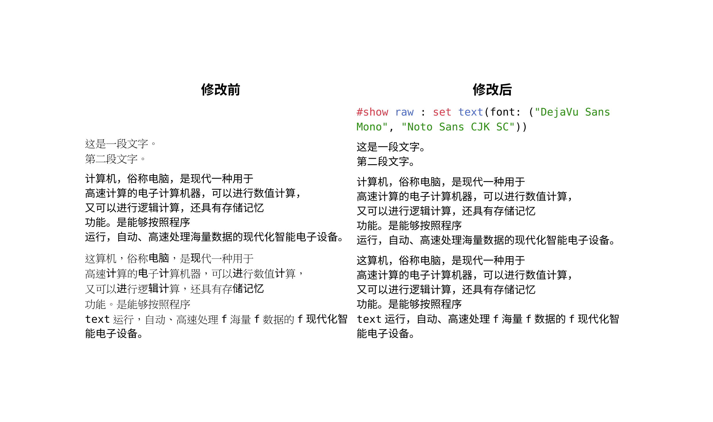

# 为什么代码块里面的中文字体显示不正常？

首先，请参考 [为什么中文字体这么奇怪](./strange-fonts.md) 对正文字体进行配置。

然后，对于代码块，需要在源代码文件中使用类似的命令设置字体：

```typst no-render
#show raw : set text(font: ("DejaVu Sans Mono", "Noto Sans CJK SC"))
```

其中，「DejaVu Sans Mono」是等宽字体，「Noto Sans CJK SC」是一个你需要的中文字体。工作原理是等宽字体中没有中文字符，因此 `fallback` 到第二字体上。

因此，你需要需要保证你没有如 `#show raw: set text(fallback: false)` 的命令在你的文档中。**同时**要保证你的等宽字体中没有任何的 CJK 字符，否则会造成中文字体不统一。

相关 issue：https://github.com/typst/typst/issues/5748



## 相关内容

- [代码块中西文间有多余的空格](./cjk-latin-spacing-in-raw.md)
- [代码块里多了空格/代码块的对齐非常奇怪](./code-block-justify.md)
