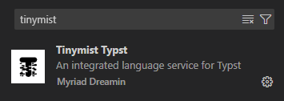

# 快速开始

## 在线使用

适用场景：快速，免安装，多人协作。

打开官网 [typst.app](https://typst.app/)，注册账号。新建文档即可。

<!--TODO
截图
--->

（官方出品的 [Pro](https://typst.app/pricing/)，热心的朋友可以试试，算是打赏一下开发者~）

## 本地安装

### VS Code（推荐）

适用场景：深度自定义，离线使用，顾及隐私。（补全体验也比官方好亿点点哦）

[安装 VS Code](https://code.visualstudio.com/)。

点击左侧扩展图标，搜索 `Tinymist` 插件并安装

::: warning
不要安装 `Typst LSP` 插件和 `Typst Preview` 插件，这两个插件已废弃，功能已经整合到 `Tinymist` 插件中。

如果之前安装了这两个插件请卸载，否则会导致冲突。
:::

如果你需要代码格式化功能，点击左下角齿轮图标，选择设置，搜索 `tinymist formatter`，将其设置为 `typstyle`，如下图所示。

……

typst 会自动扫描到系统中安装的字体，使用 `typst fonts` 命令可以列出所有可用的字体。

### Vim

### 命令行

Typst 的命令行工具可以通过多种方式获取，详见 [官方文档](https://github.com/typst/typst?tab=readme-ov-file#Installation)

#### 预编译二进制文件

你可以从 [Typst 发布页面](https://github.com/typst/typst/releases) 获取最新版本的源码和预编译二进制文件。

下载适合你平台的压缩包并将其放置在 PATH 环境变量包含的目录中。

要获取未来版本的更新，只需运行 `typst update` 命令。

#### 包管理器安装

你也可以通过不同的包管理器安装 Typst。

:::details 部分包管理器和命令

| 系统 | 包管理器 | 命令 |
| :--- | :--- | :--- |
| Any | Cargo | `cargo install --locked typst-cli` |
| Linux & macOS | Nixpkgs | `nix-shell -p typst` |
| macOS | Homebrew | `brew install typst` |
| Arch Linux | Pacman | `pacman -S typst` |
| Windows | Winget | `winget install --id Typst.Typst` |

:::

#### 使用方法

安装完成后，根据[官网文档](https://github.com/typst/typst?tab=readme-ov-file#usage)在命令行中编译文件。
