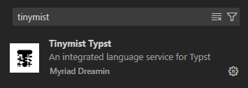

# 快速开始

## 一图认识Typst

<!--
此节修改自官方 README 的 Example 一节 https://typst-community.github.io/extra-docs/typst/#example
术语沿用 https://typst.dev/docs/glossary/
-->

[官方文档 Typst Documentation](https://typst.app/docs/) 有完善介绍；不过深入之前，您可先通过下图这个例子了解Typst的能力。

```typst
#set page(width: 20em, height: auto, margin: 1.5em)
#set heading(numbering: "1.")
#set par(leading: 1em)
#set text(lang: "zh", font: "Source Han Serif SC")

= Fibonacci数列
Fibonacci数列由 $F_n = F_(n-1) + F_(n-2)$ 递归定义，其*通项公式*为
$
  F_n = round(phi.alt^n / sqrt(5)), quad
  phi.alt = (1 + sqrt(5)) / 2.
$

#let count = 8
#let nums = range(1, count, inclusive: true)
#let fib(n) = {
  if n <= 2 { 1 }
  else { fib(n - 1) + fib(n - 2) }
}

Fibonacci数列的前 #count 项如下表。

#align(center, table(
  columns: count,
  ..nums.map(n => $F_#n$),
  ..nums.map(n => str(fib(n))),
))
```

拆解一下：

- 用[**set规则**](https://typst.app/docs/reference/styling/#set-rules)设置元素属性，例如页面尺寸、标题编号格式、行距、[中文字体](./FAQ/install-fonts.md)。`1em`表示一个汉字的宽度，而将页面高度设为`auto`表示按内容自动伸缩。多数需求用set规则即可，而进一步灵活定制可用[show规则](https://typst.app/docs/reference/styling/#show-rules)。

- 用`= 标题`语法插入章节标题，等号数量对应标题级别。Typst 定义了很多这样的简易标记语法，详见 [Syntax](https://typst.app/docs/reference/syntax/)。

- `$`包裹的内容表示[数学公式](https://typst.app/docs/reference/math/)。`$…$`内两边不加空格表示行内公式，而加空格`$ … $`则表示独行公式。多字母连写表示 Typst 的标识符，因此`floor`、`sqrt`等函数无需反斜杠；用引号括起表示文本，例如`$ x_"引号" $`。`phi.alt`表示用`alt`修饰`phi`，代表与 φ 符号不同的 ϕ 变体。

- `#`紧跟表达式表示从标记模式进入[脚本模式](https://typst.app/docs/reference/scripting/)。上例定义了两个变量和一个函数来递归计算第n个Fibonacci数，然后在表中展示结果并居中对齐。`table`函数按行录入单元格，所以这里先传入公式`$F_1$`至`$F_8$`，再传入计算出的Fibonacci数。两次都用了展开运算符`..`，因为它们原本是数组，而`table`函数要求每个单元格按单独参数传入。

## 在线使用

适用场景：快速，免安装，多人协作。

打开官网 [typst.app](https://typst.app/)，注册账号，新建文档即可。不注册也用 [typst.app/play](https://typst.app/play) 临时尝试。

（官方出品的 [Pro](https://typst.app/pricing/)，热心的朋友可以试试，算是打赏一下开发者~）

## 本地使用

### VS Code（推荐）

适用场景：深度自定义，离线使用，顾及隐私。（补全体验也比官方好亿点点哦）

1. [安装 VS Code](https://code.visualstudio.com/)。

2. 单击左侧扩展图标，搜索 [Tinymist Typst 插件](https://marketplace.visualstudio.com/items?itemName=myriad-dreamin.tinymist)并安装。

   

3. 创建后缀为`.typ`的文件，开始写作。

补充：

- 写作时可按 Shift+Alt+F 格式化文档，让代码更方便浏览。（该功能利用 Tinymist 集成的 [Typstyle](https://typstyle-rs.github.io/typstyle/) 实现）

- 安装后 Typst 应该能扫描到系统中安装的字体。如果遇到问题，可参考[如何设置（中文）字体](./FAQ/install-fonts.md)。

- 不要安装 Typst LSP 或 Typst Preview 插件，这些插件已经废弃，功能已经整合到 Tinymist 插件中。如果之前安装了这两个插件，请卸载，否则会与 Tinymist 插件冲突。

- Tinymist以Rust包的形式内置了Typst，因此无需安装Typst命令行就能使用。不过若您习惯使用命令行，也可一同[安装Typst命令行](#命令行)。

### Vim/Helix/Zed/…

请参考 [Editor Frontends – Tinymist Docs](https://myriad-dreamin.github.io/tinymist/frontend/main.html)。

### 命令行

Typst的命令行工具可以通过多种方式获取，详见 [Typst 官网 → Open Source → Go to downloads](https://typst.app/open-source/#download)。该网页会识别你所用的操作系统和架构，按平台介绍可执行文件、包管理器等安装方式。

如果你选择下载可执行文件，那么建议参考官网所附链接配置`PATH`环境变量，方便调用。另外Typst可执行文件有数十MB，而官网链接至GitHub，国内可考虑换用 [CERNET 校园网联合镜像站](https://mirrors.cernet.edu.cn/app/Typst)（镜像站网页需自行选择平台，如不清楚，可先尝试 Windows, x86_64）。

安装后可参考[官方 README 的 Usage 一节](https://typst-community.github.io/extra-docs/typst/#usage)或[小蓝书首页的「使用typst-cli与PDF阅读器」](https://typst-doc-cn.github.io/tutorial/introduction.html)在命令行编译`*.typ`文档。
