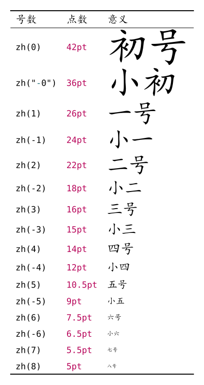

# 面向 Word 用户的快速入门向导

::: tip
在阅读本文前，请确保你已经了解了 [Typst](https://typst.app/) 是什么并且已经[安装了 Typst 的运行环境](https://typst-doc-cn.github.io/tutorial/introduction.html)。
:::

大家能看到这篇文章，或多或少都是因为对于排版或者样式定制有一定的需求。这篇文章将会帮助你快速上手 Typst 并且开始使用 Typst 的排版功能。

Word 是一个开箱即用、所见即所得的软件，而其弊端就在于其排版的不稳定性以及将文章视为「一系列格式各异的元素」。而 Typst 或 LaTeX 相较之下则将文章视为「一系列逻辑结构」，通过定义逻辑结构、约束不同结构的样式来实现排版，将内容的写作与样式的定义分离开来。因此，在使用 Typst 时，更多时候会关注于文章内容结构本身，对于常规的样式则几乎是一个「一劳永逸」的过程（非常规指的是复杂需求的排版，比如绘图、批注等等）。

本文将会介绍 Typst 中的一些常用样式设置，以及如何将 Word 中的样式迁移到 Typst 中。部分内容摘选自[小蓝书](https://typst-doc-cn.github.io/tutorial)。

::: tip
本文会使用绿色的 TIP 穿插一些关于 Typst 的基础知识，但不会过多展开。
:::

## 字体

在复制一段中文文本后，你可能会发现这样的问题：


由于 Typst 并非由国人设计，它的默认字体并不适合中文排版。因此，我们需要对 Typst 的字体进行一些设置。在文章的开头，我们可以使用 `#set text(font: "Noto Sans CJK SC", lang: "zh", region: "cn")` 来设置文章正文的字体为「思源黑体」、语言为「中文」、地区为「中国」。这样，我们就可以保证中文的排版效果。如果你需要使用其他字体，可以参考 [为什么中文字体这么奇怪](./FAQ/install-fonts.md)。

要调整正文字体的大小，可以使用 `#set text(size: 12pt)` 来设置字体大小为 12 磅。

```typst no-render
#set text(font: "Noto Sans CJK SC", lang: "zh", region: "cn", size: 12pt)
```

::: tip
这里的 `#` 是 Typst 由默认的内容模式进入脚本模式的标志。在这里，我们使用 `set` 命令设置文本 `text` 的参数。参数是一系列的键值对，用冒号 `:` 分隔。在这里，我们设置了 `font`、`lang`、`region` 和 `size` 四个参数。
:::

为了与 Word 中的字号相对应，你也可以使用 pointless-size 包，如以下代码所示：

```typst no-render
#import "@preview/pointless-size:0.1.0": zh, zihao

#set text(size: zh(5)) // 五号（10.5pt）
```

::: tip
包是 package 的翻译，是一些由 [Typst 社区](https://typst.app/universe)提供的功能扩展。在 Typst 中，你可以通过 `#import` 命令引入包，然后使用包中的功能。在这里，我们引入了 `pointless-size` 包，并使用了其中的 `zh` 函数来设置字号。
:::

pointless 包中更多的字号与命令的对应请参考下图：



### 常用的字体设置与装饰

| 设置 / 装饰 | 语法标记 | 对应函数                     |
| ----------- | -------- | ---------------------------- |
| 粗体        | `*粗体*` | `#strong[粗体]`              |
| 斜体        | `_斜体_` | `#emph[斜体]`                |
| 下划线      | /        | `#underline[下划线]`         |
| 删除线      | /        | `#strike[删除线]`            |
| 下标        | /        | `#sub[下标]`                 |
| 上标        | /        | `#super[上标]`               |
| 文本高亮    | /        | `#highlight[高亮]`           |
| 文本颜色    | /        | `#text(fill: red)[红色文本]` |

其中，`#text(fill: red)[红色文本]` 可以设置文本的颜色，`red` 可以替换为其他颜色，如 `blue`、`green` 等。`fill` 参数接收的是一个颜色，可以参考[小蓝书](https://typst-doc-cn.github.io/tutorial/basic/scripting-color-and-shape.html)中有关颜色的介绍。`#highlight(fill: yellow)[高亮]` 可以设置文本的背景色，`yellow` 可以替换为其他颜色，这个是同理的。

中文字体并不一定提供了粗体和斜体的变体。Word 原生提供了伪粗体和伪斜体的功能，但 Typst 原生并不默认支持，因此在使用粗体和斜体时可能会出现问题。详情请参考：

- [设置的字体未生效？](./FAQ/install-fonts.md)
- [中文的粗体](./FAQ/chinese-bold.md)
- [中文的斜体](./FAQ/chinese-skew.md)

## 段落

和 Markdown 类似，Typst 也使用空行来分隔段落。如下面的例子所示：

```typst
这是第一个段落。
这里没有空行，所以这句话和上一句在同一个段落中。
```

::: tip
上面的例子中换行会产生一个空格，这不是一个正确的行为，可能会在后续版本中修复。
:::

```typst
这是第一个段落。

这里有一个空行，所以这句话和上一句在不同的段落中。
```

而如果需要强制换行而不划分段落，可以使用 `\`，等价于 Word 中的 Shift+Enter 快捷键：

```typst
这是第一行。\
这是第二行。
```

连续的空格会被合并为一个空格。如果需要输入多个空格，可以使用 `~`：

```typst
A     B

A~~~~~B
```

::: tip
有关段落可进一步参考[小蓝书相关章节](https://typst-doc-cn.github.io/tutorial/basic/writing-markup.html#label-grammar-paragraph)。
:::

### 对齐方式

在 Typst 中，如果需要设置局部的对齐方式，可以使用 `#align(left)[左对齐]`、`#align(right)[右对齐]`、`#align(center)[居中]`。

```typst
文字默认是左对齐的。

#align(center)[但我想临时居中！]

而不影响其他文字。
```

使用 `#set align(left)`、`#set align(right)`、`#set align(center)` 来设置之后所有文本的对齐方式。

```typst
#set align(left)
这行字左对齐

#set align(right)
这行字右对齐

#set align(center)
这行字居中
```

在 Word 的工具栏中，还有两种对齐方式，分别是两端对齐和分散对齐。在 Typst 中，两端对齐由段落的 `justify` 参数控制。

```typst
#set par(justify: false)
This is a 中英文混排段落，如果 not 使用 `justify` 参数，将会默认为左对齐。而这 maybe 会很 ugly。

#set par(justify: true)
This is a 中英文混排段落，如果 not 使用 `justify` 参数，将会默认为左对齐。而这 maybe 会很 ugly。
```

而分散对齐请参考：[如何实现分散对齐？](./FAQ/character-intersperse.md)

### 段落缩进

段落的缩进可分为首行缩进和整段缩进。首行缩进是指段落的第一行缩进，而整段缩进是指段落的所有行都缩进。在 Typst 中，分别由 `par` 的 `first-line-indent` 和 `hanging-indent` 参数控制。

<!--
```typst no-render
#set par(first-line-indent: 2em, hanging-indent: 2em)

此处的例子暂时不适合渲染，因为 0.13 尚未发布。
```
-->

### 列表

在 Typst 中，列表分为有序列表和无序列表。无序列表使用 `-` 开头，用缩进表示层级关系。有序列表使用显式的编号 `1. ` 或 `+` 开头，用缩进表示层级关系。

```typst
+ 一级列表项 1
  - 二级列表项 1.1
    + 三级列表项 1.1.1
  - 二级列表项 1.2
+ 一级列表项 2
  - 二级列表项 2.1

列表间插入一段描述，列表项 3 被吃掉了。

4. 列表项 4
+  列表项 5
+  列表项 6
```

默认列表使用紧凑模式。而列表各行之间可以插入空行，这样列表就会变得没那么紧凑。

### 行距和段距

在 Typst 中，行距和段距分别由 `par` 的 `leading` 和 `spacing` 参数控制。行距是指行与行之间的距离，段距是指段与段之间的距离。

::: tip
有关长度单位的介绍请参考[小蓝书的度量与布局](https://typst-doc-cn.github.io/tutorial/basic/scripting-length-and-layout.html)。你可以简单理解成 em 就是当前一个字的长度，是一个相对单位。当然以下例子中的行距和段距也可以使用绝对单位，如 `12pt`、`1cm` 等。
:::

```typst
#set par(leading: 0.65em, spacing: 1em)

这里的行距是 0.65em，段落间距是 1em。

#lorem(5)

#lorem(5)

#set par(leading: 1em, spacing: 2em)

这里的行距是 1em，段落间距是 2em。

#lorem(5)

#lorem(5)
```

### 字间距和词间距

使用 `text` 的 `tracking` 参数可以设置字符间距，`spacing` 参数设置词间空格宽度。

```typst
#text(spacing: 20pt)[#lorem(5)]

#text(tracking: 2pt)[#lorem(5)]
```

### 水平方向或竖直方向的空白

使用 `#h(1em)` 可以插入水平方向的空白，而使用 `#v(1em)` 可以插入竖直方向的空白。

```typst
这里有一些空白：#h(1em)这里有一些空白。

这里有一些空白：#v(1em)这里有一些空白。
```

借助这个特性，我们可以实现一些行内的等分排列：

```typst
左 #h(1fr) 右
#v(1fr)
左 #h(1fr) 中 #h(1fr) 右
```

这里的 `fr` 表示比例，它也是一个相对单位，在同一个部分的 `fr` 会按照不同的比例平分剩余的空间，因此同样的系数平分的空间是相等的。

### 竖排

暂未支持。

## 标题

使用一个或多个连续的「等于号」（=）开启一个标题。不同数量的等于号划分了标题的层级、对应其在大纲中的级别。

::: tip
如果你使用过 Markdown，可能会发现 Markdown 中通常将一级标题视为文档属性的标题，而 Typst 中的标题则是文档的章节。因此，Typst 中的标题可以有多个一级标题。对于全文的标题，使用 `#set document(title: "文档标题")` 来设置文档属性。
:::

```typst
= 一级标题
我走了。
== 二级标题
我来了。
=== 三级标题
我走了又来了。
```

要设置标题的样式，需要使用 `show` 或者 `set` 命令。

### 标题编号

Typst 的标题编号是自动的，可以通过修改 `heading` 的 `numbering` 参数来设置编号的格式。`numbering` 传入一个字符串，它会解析其中的各级编号和分隔符。

```typst
#set heading(numbering: "1.a.i")
= 一级标题
我走了。
== 二级标题
我来了。
== 二级标题
我来了吗？
=== 三级标题
我走了又来了。
```

但这里编号会有一些问题，它对于全角符号的支持并不好，比如：

```typst
#set heading(numbering: "一、1.a.i")
= 一级标题
我顿号没了。
== 二级标题
我也没了。
```

推荐使用群友科技 [numbly](https://typst.app/universe/package/numbly) 包来解决这个问题。

```typst
#import "@preview/numbly:0.1.0": numbly
#set heading(numbering: numbly(
  "{1:一}、",
  "{2:1}.",
  "{2:1}.{3:a}.",
  "{2:1}.{3:a}.{4:i}.",
))
= 一级标题
我走了。
== 二级标题
我来了。
== 二级标题
我来了吗？
=== 三级标题
我走了又来了。
```

仍存在的问题是，顿号后有一个代码中写死的一小段空格，请参考[如何去掉标题的编号后面的空格？](./FAQ/heading-numbering-space.md)。

## 插入非文本元素

### 表格

在 Typst 中插入表格基本的语法是：

```typst
#table(
    columns: 3, // 列数
    table.header([表头 1], [表头 2], [表头 3]), // 表头
    [内容 1], [内容 2], [内容 3], // 第一行
    [内容 4], [内容 5], [内容 6], // 第二行
)
```

其中 `columns` 参数是必须的，它可以传入一个数字，表示表格的列数，也可以传入一系列的长度，表示每一列的宽度。比如下面这个例子实现了各列宽度相等的三列表格：

```typst
#table(
    columns: (1fr, 1fr, 1fr),
    table.header([表头 1], [表头 2], [表头 3]),
    [内容 1], [内容 2], [内容 3],
    [内容 4], [内容 5], [内容 6],
)
```

类似的，也可以传入 `rows` 参数，表示表格的行数和行高，但是这个参数并不是必须的，因为 Typst 会自动根据内容的多少来自动向下延伸表格。

`table.header()` 表示表头的内容，当一个表格跨页的时候，它会在每一页的表格上方显示。

```typst
#table(
    columns: 3,
    table.header([表头 1], [表头 2], [表头 3]),
    [内容 1], [内容 2], [内容 3],
    [内容 4], [内容 5], [内容 6],
    [内容 7], [内容 8], [内容 9],
    [内容 10], [内容 11], [内容 12],
    [内容 13], [内容 14], [内容 15],
    [内容 16], [内容 17], [内容 18],
    [内容 19], [内容 20], [内容 21],
)
```

关于常用的表格设置，可以参考[如何实现三线表？](./FAQ/three-line-table.md)。

如果需要导入外部的 Excel 表格，可以使用群友科技 [rexllent](https://typst.app/universe/package/rexllent) 包。如果使用 VSCode 并且已经安装了 tinymist，你可以试试直接将 Excel 表格拖入编辑器中。

### 图片

使用 `#image` 命令插入图片：

```typst no-render
#image("这里填路径", width: 100pt, height: 100pt)
```

`width` 和 `height` 参数可以设置图片的宽度和高度。如果只设置其中一个，另一个会按照图片的比例自动调整。这两个参数都不是必须的，如果不设置，图片会按照原始大小或最大页面宽度自动调整。

需要注意的是，Typst 不支持插入网络图片，只能插入本地图片。如果你需要插入网络图片，可以先下载到本地，然后再插入。

### 数学公式

Typst 的数学公式用 `$` 包裹，在 `$` 之间加入空格或换行可以切换至公式块模式。

```typst
#set page(height: auto)
行间公式：$(a+b)^2 = a^2 + 2 a b + b^2$

公式块：
$ (a+b)^2 = a^2 + 2 a b + b^2 $

$
(a+b)^2 = a^2 + 2 a b + b^2
$
```

关于 Typst 的数学公式语法，与 LaTeX 相比，可以试试以下步骤：

1. 将 LaTeX 公式中的 `\frac` 改为 `/`，如 `\frac12` 改为 `1/2`。在 Typst 中，`/` 通常会显示成水平的分数线，如果需要写成斜杠，可以使用 `\/` 进行转义或者使用群友科技 [slashion](https://typst.app/universe/package/slashion/) 包。
2. 将 LaTeX 公式中的不同元素用空格分隔，如 `2ab` 在 Typst 中应该写为 `2 a b`。
3. 许多在 LaTeX 中需要反斜杠才能引出的符号在 Typst 中可以直接输入，参见[小蓝书的常用数学符号](https://typst-doc-cn.github.io/tutorial/basic/reference-math-symbols.html)。

这一部分建议还是多看看官方文档的 [math](https://typst.app/docs/reference/math/) 部分，三言两语不太容易说清。

如果已经习惯了 LaTeX 写法无心改变，可以尝试使用 [mitex](https://typst.app/universe/package/mitex/) 包来写入 LaTeX 公式。或者使用 [detypstify](https://github.com/detypstify/detypstify) 或群友科技 [typress](https://github.com/ParaN3xus/typress) 识别公式、输出 Typst 代码。

### 代码

和 Markdown 类似，使用反引号（`）包裹代码：

```typst
`print("Hello, world!")`
```

如果需要插入代码块，可以使用三个反引号：

````typst
```typst
#text(fill: red)[红色文本]
```
````

自定义代码块的样式（比如行号）需要使用 `show` 或者 `set` 命令。或者，你也可以使用社区提供的代码美化包，比如：

- 代码美化豪华包 [codly](https://typst.app/universe/package/codly)
- 群友科技 [zebraw](https://typst.app/universe/package/zebraw)

````typst
#set page(paper: "a4", height: auto, margin: 1cm)
#import "@preview/zebraw:0.3.0": *
#show: zebraw
#zebraw(
  highlight-lines: (
    (3, [to avoid negative numbers]),
    (6, [0 is not a right argument to fibonacci_reccursive()!]),
  ),
  header: "fibonacci_reccursive()",
  ```rust
  pub fn fibonacci_reccursive(n: i32) -> u64 {
      if n < 0 {
          panic!("{} is negative!", n);
      }
      match n {
          0 => panic!("zero is not a right argument to fibonacci_reccursive()!"),
          1 | 2 => 1,
          3 => 2,
          /*
          50    => 12586269025,
          */
          _ => fibonacci_reccursive(n - 1) + fibonacci_reccursive(n - 2),
      }
  }
  ```,
)
````

### 图形

可以通过 figure 函数为图像或任意内容设置标题：

````typst
#set text(lang: "zh", region: "cn") // 用于将默认的 supplement 改为中文
#figure(```typ
#image("/assets/files/香風とうふ店.jpg")
```, caption: [用于加载香風とうふ店送外卖的宝贵影像的代码])

#figure(
  table(
    columns: 2,
    [A], [B],
  ),
  caption: "一个简单的表格",
)

````

### 链接

Typst 会自动识别文中的 HTTPS 和 HTTP 链接文本并创建链接。手动使用 `#link()[链接文本]` 可以创建一个链接。

```typst
#show link: set text(fill: blue) // 设置链接的颜色为蓝色

https://zh.wikipedia.org

#link("https://zh.wikipedia.org")[维基百科]
```

在 Typst 中，可以通过创建标签标记任意内容。要引用该标签，可以使用 `@` 或者 `#link(<标签名>)`。

```typst
#show link: set text(fill: blue) // 设置链接的颜色为蓝色
#show ref: set text(fill: red) // 设置引用的颜色为红色

#figure(
  table(
    columns: 2,
    [A], [B],
  ),
  caption: "一个简单的表格",
)<table1>

== 一个神秘标题 <mystery>

@table1 后面讲述了#link(<mystery>)[一个神秘标题]。

```

### 参考文献、脚注与引用

Typst 使用 `#bibliography` 命令来插入参考文献。在文中引用参考文献时，使用 `#cite` 命令。

```typst no-render
例子暂无。
```

使用 `#footnote` 命令来插入脚注。

````typst
#set page(height: auto)
在任意地方使用 ```typ #footnote``` 来插入一个脚注。比如这里#footnote[这个地方就是一个脚注]就是一个脚注。脚注会#footnote[自动编号]自动编号。
````

## 页面

Typst 的页面默认是 A4 纸，纵向排列，页边距为 2.5cm。如果需要设置页面的大小、方向、页边距，可以使用 `#set page` 命令。

::: tip
每次 `#set page` 都会产生一个新页。
:::

下面例子中的灰色框是版心轮廓。

```typst
#set page(paper: "a4")
#rect(width: 100%, height: 100%, stroke: gray)
```

### 大小、方向与页边距

使用预设的各种 paper 传入 `paper` 参数，可以设置页面的大小。`flipped` 参数可以让页面横向。

```typst
#page(paper: "a5", flipped: true)[#rect(width: 100%, height: 100%, stroke: gray)[= A5]]
#page(paper: "a4")[#rect(width: 100%, height: 100%, stroke: gray)[= A4]]
```

可以使用 `width` 和 `height` 参数来设置页面的宽度和高度。如果没有指定纸张类型，则会在预设的 "a4" 基础上修改参数。设置为 `auto` 时，页面的宽度或高度会自动调整，不会自动分页。

```typst
滚滚长江东逝水，浪花淘尽英雄。是非成败转头空。青山依旧在，几度夕阳红。
白发渔樵江渚上，惯看秋月春风。一壶浊酒喜相逢。古今多少事，都付笑谈中。
// v.s.
#set page(height: auto)
滚滚长江东逝水，浪花淘尽英雄。是非成败转头空。青山依旧在，几度夕阳红。
白发渔樵江渚上，惯看秋月春风。一壶浊酒喜相逢。古今多少事，都付笑谈中。
```

同理，可以使用 `margin` 参数来设置页边距。这个参数传入的值比较多样：

- 当传入一个长度值时表示四边的页边距都是这个值。

  ```typst
  #set page(paper: "a5", margin: 1cm)
  #rect(width: 100%, height: 100%, stroke: gray)[= margin: 1cm]
  ```

- 传入一个字典，指定上下左右方向的页边距。当然也是传什么才修改什么，不传的话就不会修改（默认是 2.5cm）。

  ```typst
  #set page(paper: "a5", margin: (top: 1cm, bottom: 2cm, right: 4cm))
  #rect(width: 100%, height: 100%, stroke: gray)[= margin: (top: 1cm, bottom: 2cm, right: 4cm)]
  ```

- 传入一个字典，指定水平方向和竖直方向的页边距。

  ```typst
  #set page(paper: "a5", margin: (x: 1cm, y: 2cm))
  #rect(width: 100%, height: 100%, stroke: gray)[= margin: (x: 1cm, y: 2cm)]
  ```

- 传入一个字典，指定页面内侧和外侧的页边距。内侧和外侧即相对装订而言，装订线的一侧是内侧，另一侧是外侧。奇数页的内侧是左侧，偶数页的内侧是右侧。

  ```typst
  #set page(paper: "a5", margin: (inside: 1cm, outside: 2cm))
  #rect(width: 100%, height: 100%, stroke: gray)[= margin: (inside: 1cm, outside: 2cm)]
  #rect(width: 100%, height: 100%, stroke: gray)[= margin: (inside: 1cm, outside: 2cm)]
  ```

### 页眉、页脚与页码

通过传入 `header` 和 `footer` 参数可以设置页眉和页脚。页眉和页脚的内容可以是任意的 Typst 内容。

如果指定了 `page` 的 `numbering` 参数，页码会自动显示在页脚中。使用 `#counter(page).update(1)` 可以手动更新页码。

```typst
#set page(numbering: "1")

#rect(width: 100%, height: 100%, stroke: gray)[#lorem(10)]

#rect(width: 100%, height: 100%, stroke: gray)[#lorem(10)]

#counter(page).update(1)

#rect(width: 100%, height: 100%, stroke: gray)[#lorem(10)]
```

也可以手动操控页码在页脚的显示方式：

```typst
#set page(
  height: 5cm,
  width: 10cm,
  header: [A Tutorial #h(1fr) for Word Users],
  footer: context [
    #set align(right)
    #set text(8pt)
    #counter(page).display(
      "1 of 1", // 类似 numbering 的写法
      both: true, // 既显示当前页数，也显示总页数
    )
  ],
)

#rect(width: 100%, height: 100%, stroke: gray)[#lorem(40)]
#rect(width: 100%, height: 100%, stroke: gray)[#lorem(40)]
```

### 分栏

使用 `columns` 参数可以将页面分为多栏。

```typst
#set page(columns: 2)
滚滚长江东逝水，浪花淘尽英雄。是非成败转头空。青山依旧在，几度夕阳红。
白发渔樵江渚上，惯看秋月春风。一壶浊酒喜相逢。古今多少事，都付笑谈中。
```

### 背景

使用 `background` 参数可以设置页面的背景，传入的是任意的内容。使用 `fill` 参数可以设置页面的背景颜色。

```typst
#set page(
  fill: black,
  background: rotate(
    24deg,
    text(18pt, fill: rgb("FFCBC4"))[
      *I AM WATCHING U*
    ],
  ),
)
#set text(white)
孩子们好久不见！
```

### 空白页与分页

一个空白页其实就是调用 `#page[]` 函数传入一个空白内容。

```typst
滚滚长江东逝水，浪花淘尽英雄。是非成败转头空。青山依旧在，几度夕阳红。
白发渔樵江渚上，惯看秋月春风。一壶浊酒喜相逢。古今多少事，都付笑谈中。
#page[]
滚滚长江东逝水，浪花淘尽英雄。是非成败转头空。青山依旧在，几度夕阳红。
白发渔樵江渚上，惯看秋月春风。一壶浊酒喜相逢。古今多少事，都付笑谈中。
```

当然，像前面的例子所示，这个页面也可以有各种各样的内容。

```typst
滚滚长江东逝水，浪花淘尽英雄。是非成败转头空。青山依旧在，几度夕阳红。
白发渔樵江渚上，惯看秋月春风。一壶浊酒喜相逢。古今多少事，都付笑谈中。
#page(
  fill: black,
  background: rotate(
    24deg,
    text(18pt, fill: rgb("FFCBC4"))[
      *I AM WATCHING U*
    ],
  ),
)[#set text(white)
  孩子们好久不见！]
滚滚长江东逝水，浪花淘尽英雄。是非成败转头空。青山依旧在，几度夕阳红。
白发渔樵江渚上，惯看秋月春风。一壶浊酒喜相逢。古今多少事，都付笑谈中。
```

通常要分页而不是插入一个页面的时候，只需调用 `#pagebreak()` 函数即可。

```typst
滚滚长江东逝水，浪花淘尽英雄。是非成败转头空。青山依旧在，几度夕阳红。
白发渔樵江渚上，惯看秋月春风。一壶浊酒喜相逢。古今多少事，都付笑谈中。
#pagebreak()
滚滚长江东逝水，浪花淘尽英雄。是非成败转头空。青山依旧在，几度夕阳红。
白发渔樵江渚上，惯看秋月春风。一壶浊酒喜相逢。古今多少事，都付笑谈中。
```
